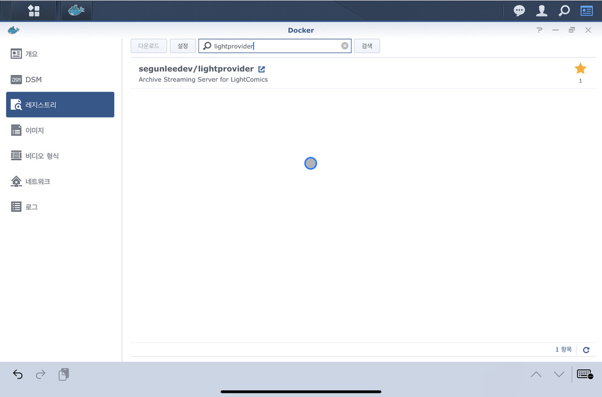
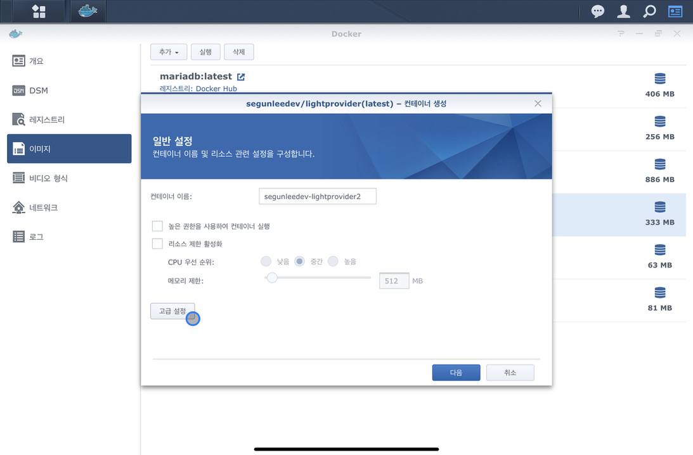
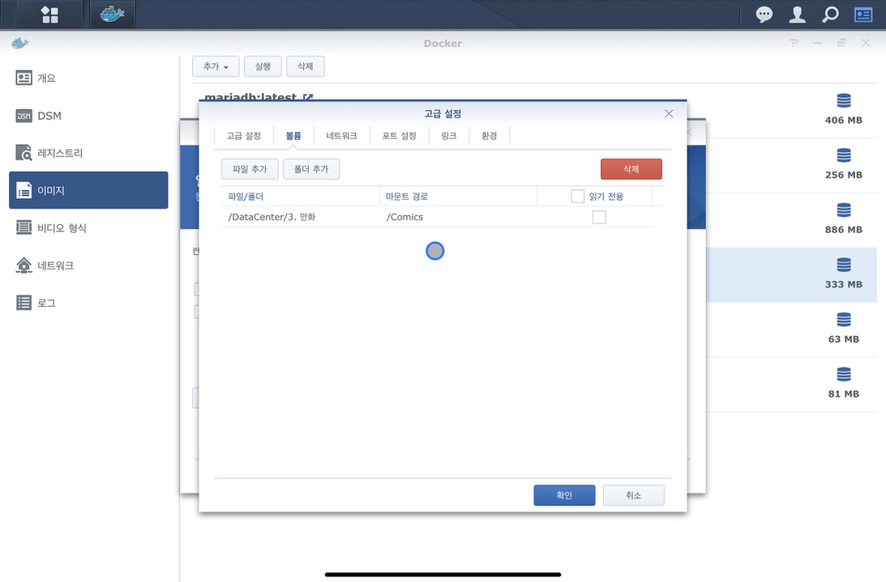
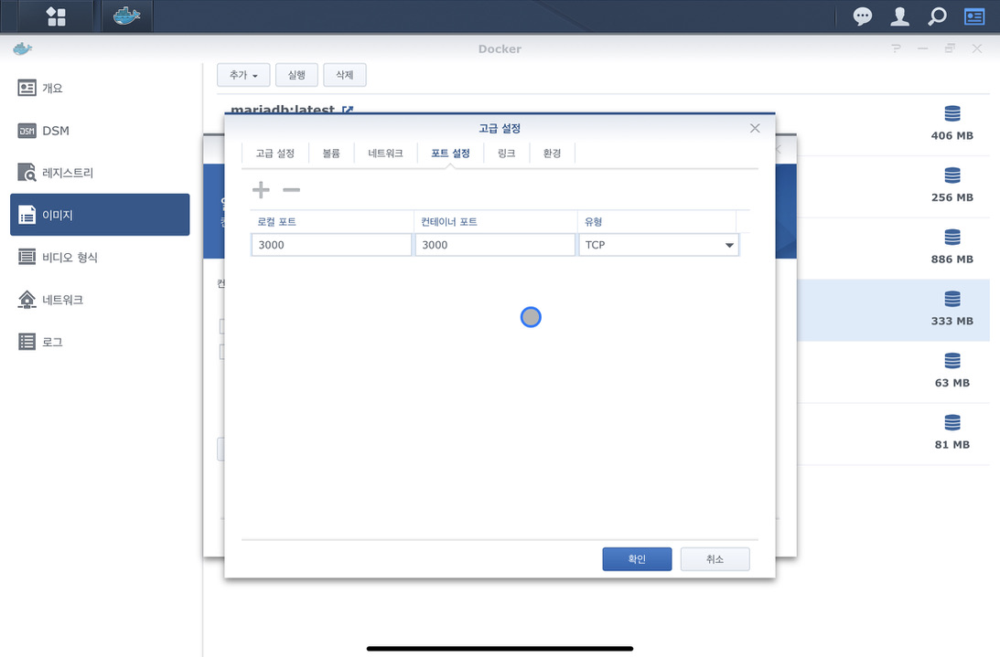
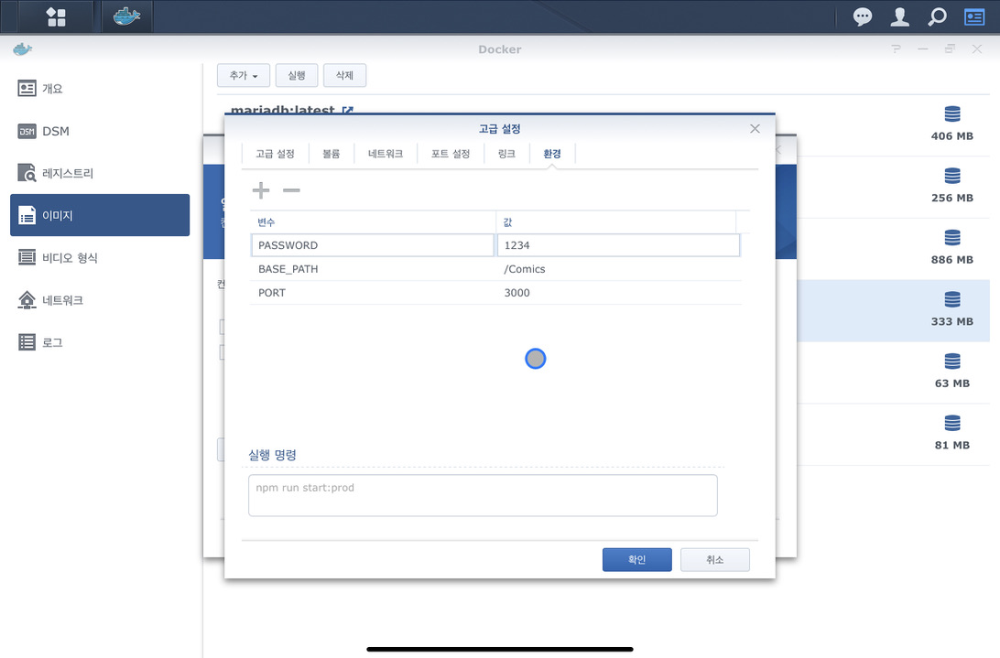

## LightProvider Docker 사용방법 (Synology 기준)

1.  시놀로지의 패키지 센터에서 Docker를 설치합니다.
    

2. Docker를 실행 한 후 레지스트리 사이드메뉴에서 lightprovider를 검색한 후 다운로드 합니다.
    

3. 다운로드가 완료되면 이미지 사이드메뉴에서 segunlee/lightprovider:latest를 더블클릭합니다.

4. 컨테이너 생성 팝업이 뜬다면 고급설정 버튼을 누릅니다.
    

5. 볼륨 탭 메뉴에서 압축파일이 있으신 경로를 마운트 합니다. (폴더 추가 버튼을 눌러 추가하세요.)

    ```
    파일/폴더: 시놀로지에 있는 파일 경로
    마운트 경로: LightProvider가 접근할 수 있는 경로
    ```

    

6. 포트설정 탭 메뉴에서 포트 설정을 합니다.

    ```
    포트는 각자 편하신 포트로 지정하시면 됩니다. 방화벽 설정이 되어 있다면 지정하신 포트는 열어 주셔야 합니다.
    ```

    

7. 환경 탭 메뉴에서 변수를 추가합니다.

    ```
    PASSWORD: 비밀번호 입력합니다.
    BASE_PATH: 5번에서 지정한 마운트 경로를 입력합니다.
    PORT: 6번에서 지정한 포트 번호를 입력합니다.
    ```

    

8. 확인을 클릭하시면 컨테이너가 생성되며 자동으로 서버가 실행됩니다.


## LightComics에서 서버 접속하기

1. iOS 앱에서 원격저장소 탭메뉴 상단 +를 눌러 LightProvider 선택
2. 서버 IP 또는 URL을 호스트에 기입
3. 서버앱의 PASSWORD값을 비밀번호에 기입
4. 서버앱에서 지정한 PORT값을 Port에 기입
5. 저장