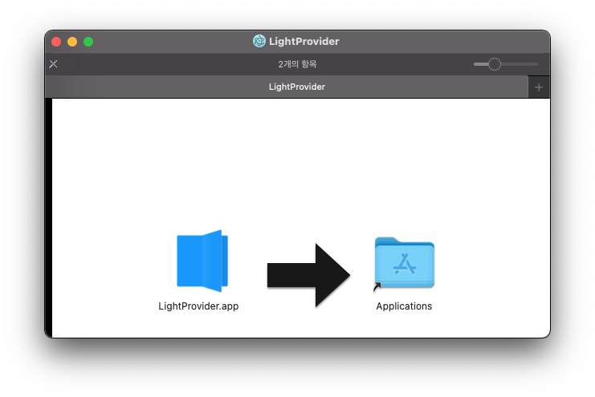
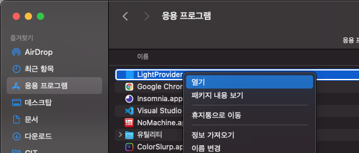
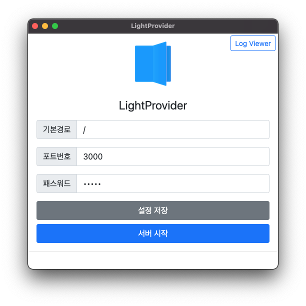

## LightProvider Mac 애플리케이션 사용방법

1. (LightProvider 1.0.0 다운로드)[https://dsm.segunlee.cloud/sharing/GMlYHbpfn]
2. 다운로드 된 LightProvider-1.0.0.dmg 실행
3. LightProvider.app 앱을 Application 폴더로 이동
    
4. LightProvider 실행 (최초 실행 시 아래와 같이 우클릭 > 열기를 하셔야 됩니다.)
    
    
5. 기본 경로 및 포트번호, 패스워드 설정 후 [설정 저장]을 하셔야 반영이 됩니다.
6. 서버 시작 버튼 클릭!

* 앱에서 최초 접근 시 접근 권한 팝업이 생성됩니다.

## LightComics에서 서버 접속하기

1. iOS 앱에서 원격저장소 탭메뉴 상단 +를 눌러 LightProvider 선택
2. 서버 IP 또는 URL을 호스트에 기입
3. 서버앱의 패스워드값을 비밀번호에 기입
4. 서버앱에서 지정한 포트번호값을 Port에 기입
5. 저장
