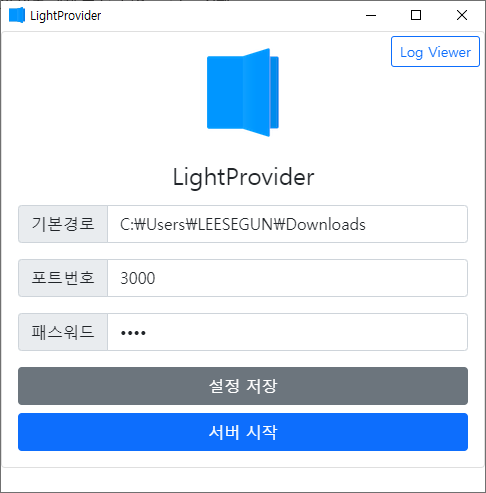

## LightProvider 윈도우 애플리케이션 사용방법

1. LightProvider 1.0.0 다운로드
    * (설치 버전[exe] 다운로드)[https://dsm.segunlee.space:5001/sharing/Iz3tuaIh1]
    
        ```
        인스톨러를 통해 설치 진행 후 LightProvider 실행
        ```
    
    * (무설치 버전[zip] 다운로드)[https://dsm.segunlee.space/sharing/dDHvnLNwR]
    
        ```
        압축 해제 후 LightProvider.exe 실행
        ```
    
2. LightProvider 실행

    

3. 기본 경로 및 포트번호, 패스워드 설정 후 [설정 저장]을 하셔야 반영이 됩니다.

4. 서버 시작 버튼 클릭!


## LightComics에서 서버 접속하기

1. iOS 앱에서 원격저장소 탭메뉴 상단 +를 눌러 LightProvider 선택
2. 서버 IP 또는 URL을 호스트에 기입
3. 서버앱의 패스워드값을 비밀번호에 기입
4. 서버앱에서 지정한 포트번호값을 Port에 기입
5. 저장